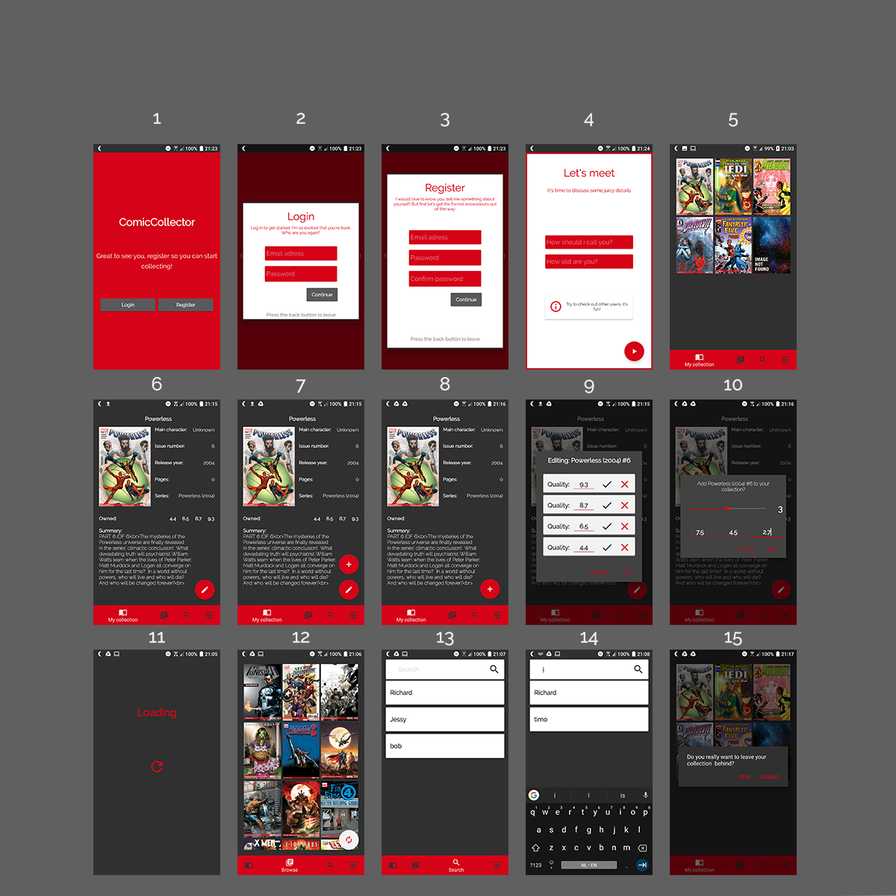

# ComicCollector

## Concept
Je kent het wel, je staat in stripboekenzaak en ziet een hele coole comic, maar hij komt je vaag bekend voor. Had je deze issue niet al? Hier kan de ComicCollector je helpen. CC is een gids die je al je verzameling opslaat en is een gids voor alle Marvel comics. 
### Doelgroep
De app richt zich tot stripverzamelaars.
### Oplossing
De app voorkomt dat de gebruiker per ongeluk dubbele comics koopt. Daarnaast kunnen collectie van andere gebruikers bekeken worden.

## Benodigheden
### Data
De app zal gebruik maken van de [Marvel API](https://developer.marvel.com/). Deze API bevat alle comics uitgebracht door Marvel en bevat zeer veel details. Hiermee kan ik in principe veel extra functionaliteiten bouwen. Je hebt een key nodig, die je gratis kan aanvragen. De API werkt met GET-requests en geeft JSON-strings terug.
### Externe componenten
Ik zal gebruik maken van [Firebase](https://firebase.google.com/) om accounts op te slaan en data met andere users te kunnen delen.
### Vergelijking met soortgelijke apps
[CLZ Comics](https://play.google.com/store/apps/details?id=com.collectorz.javamobile.android.comics&hl=en&rdid=com.collectorz.javamobile.android.comics) is een app die ook de mogelijkheid biedt om je comic collectie digitaal op te slaan. De app werkt alleen traag, is onoverzichtelijk en heel druk. Hij heeft wel de functie om mbv barcodes, strips toe te voegen. Dat is een interessante functie, maar dit zal hoogstwaarschijnlijk niet haalbaar zijn om zelf te bouwen in dit tijdsbestek.
### Moeilijkheden
Ik denk persoonlijk dat het importeren van de Marvel API het lastigste proces zal worden. Als ik dit op een goede manier voor elkaar krijg, zal de rest allemaal wel lukken.

## Functionaliteiten
Ik wil een zo compleet mogelijke app bouwen. De hoofdfunctionaliteit is het bekijken, zoeken en bijwerken van je eigen collectie. Dit moet overzichtelijk en snel werken. Daarnaast wil ik ook een catalogus van alle comics bouwen. Tot slot wil ook andere gebruikers opzoeken en bekijken. 
### Extra 
De zoek functionaliteit kan een zeer krachtige tool worden als ik een filter kan bouwen. Dit kan alleen heel veel tijd gaan kosten. Dit zal dan ook een extraatje zijn.
### video
https://youtu.be/vOfvOLtE0wg

## Bronnen
- [Firebase](https://firebase.google.com/) (Licensed onder Creative Commons Attribution 3.0 License)
- [Picasso](http://square.github.io/picasso/) (Licensed onder BSD, part MIT and Apache 2.0)
- [Marvel API](https://developer.marvel.com)  (Licensed onder Marvel licenses)

## Copyright
  Copyright 2018 Vincent Damen  

   Licensed under the Apache License, Version 2.0 (the "License");
   you may not use this file except in compliance with the License.
   You may obtain a copy of the License at

       http://www.apache.org/licenses/LICENSE-2.0

   Unless required by applicable law or agreed to in writing, software
   distributed under the License is distributed on an "AS IS" BASIS,
   WITHOUT WARRANTIES OR CONDITIONS OF ANY KIND, either express or implied.
   See the License for the specific language governing permissions and
   limitations under the License.

Data provided by Marvel. © 2014 Marvel

 © Vincent Damen, 2018

