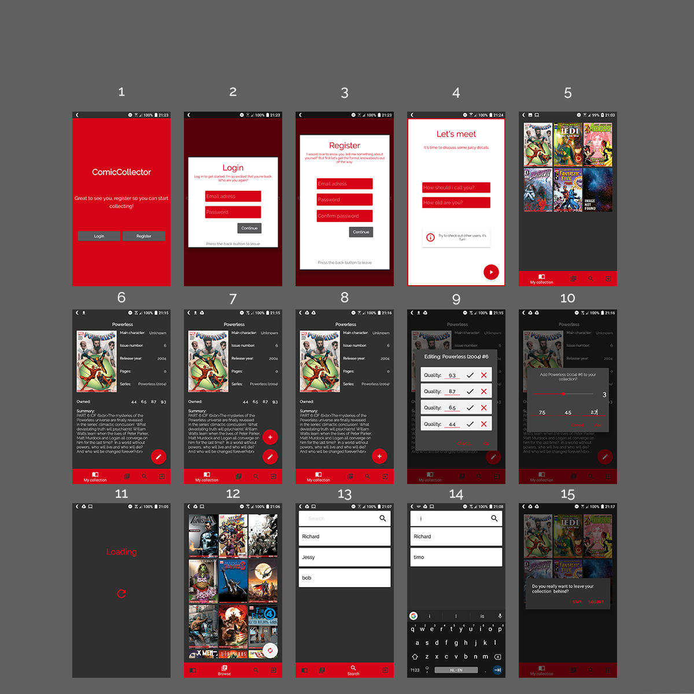

# Report
ComicCollecter is een app die stripverzamelaars helpt bij het sparen van Marvel comics. Je kan alle Marvel comics opslaan en hier een score aan toekennen. Op deze manier heb je je collectie overal bij de hand. 
*insert collection screen*
## Technical Design
comicCollector opent op de gebruiker haar collectie, dit is namelijk hetgene wat het belangrijkste is. je kan vervolgens door je collectie heen scrollen en informatie over comics vinden, door er op te klikken. 
Je kan andere strips ontdekken op de Browse-pagina. Hierop staan 50 random strips weergegeven, deze kan de gebruiker ook toevoegen aan de collectie. De gebruiker kan andere users vinden op de Search-pagina. als je deze opent staan de recente gebruikers, zodat je je favoriete gebruikers snel terug kan vinden. Tot slot kan de gebruiker uitloggen door op de Sign-out knop te drukken. Zie de video voor een gedetailleerde walkthrough.
### design
In DESIGN.md staat het originele ontwerp. Deze is totaal niet meer toepasbaar, ik heb heel veel aangepast.
Zie de overview voor voorbeelden. De structuur zit als volgt in elkaar:
- *mainActivity* (screens: 5 tot en met 15)
    - hierin worden alle fragments geladen en staan een groot aantal universele functies. Hierin is ook de bottomnavigation te vinden. 

    - *collectionView* (screens: 5,11)
        - is de class waarmee collectie grids worden weergegeven. hierin wordt bepaald welke collectie opgehaald moet worden en welke informatie moet worden doorgegeven aan de comicInfo fragment.
    - *browseComic* (screens: 11,12)
        -  is de class waarmee de browse pagina wordt gebouwd. Hierin wordt een offset bepaald, waarmee de comics opgehaald worden. Daarnaast zitten er dezelfde functionaliteiten van collectionView in .
    - *searchUsers* (screens: 13,14)
        - is de class waarmee de gebruiker andere mensen op kan zoeken. Hierin worden uit de shared preferences de recent bekeken mensen opgehaald en in firebase gezocht naar gebruikers. 
    - *comicInfo* (screens: 6,7,8,9,10,11)
        - is de class waarmee de gebruiker meer over een comic te weten komt. dit wordt ingeladen vanuit én FireBase én de Marvel API. In deze class staan veel functies die ook in andere classes worden gebruikt. Vanuit dit fragment is het mogelijk om je collectie aan te passen of toe te voegen. het toevoegen gaat door op het plusje te drukken óf als je al de comic bezit, de edit knop lang ingedrukt te houden. Je kan hem aanpassen met de edit knop.
        - *addComicDialog* (screen: 9)
            - is de class waarmee je comics kan toevoegen aan je collectie. Dit doe je door de slider op het juiste aantal te zetten en de invulvelden in te vullen. als je deze invult en bevestigt, bekijkt de class of het aan de voorwaarden voldoet en slaat hem vervolgens op in FireBase. Je kan 5 scores per keer toevoegen.
        - *editComic* (screen: 10)
            - is de class waarmee je je comics kan wijzigen. Dit doe je door in de listview, de score aan te passen en vervolgens hem te bevestigen door op het vinkje te drukken. Als je een score wilt verwijderen, moet je het kruisje lang indrukken. De gebruiker krijgt een toast te zien als hij een keer kort klikt op het kruisje. Dit is om te voorkomen dat je per ongeluk een score weggooit. Om de scores definitief bij te werken bevestig je de wijzigingen en wordt het aangepast.
- *authentication*  (screens: 1 tot en met 4)
    - Dit is de class waarin de fragments worden geladen om je aan te melden of in te loggen.
    - *loginProcess* (screen: 2)
        - is de class waarmee je kan inloggen. Hij controleert de inlog met FireBase en geeft aan wanneer je niet goed kan inloggen.
    - *registerProcess* (screens: 3,4)
        - is de class waarmee je je registreert. Hij controleert of je aan de eisen voldoet en stuurt je door naar de userInfo class. om gegevens te geven aan FireBase.

## Challenges
- Tijdens het bouwen van de app, kwam ik er vrij snel achter dat het bouwen langer zou duren dan verwacht. Het werken met images en een mooie layout blijkt soms lastiger dan met tekst. Ik heb heel veel uur gestopt in het optimaliseren van mijn layouts.
Als gevolg hiervan heb ik geen tijd gehad om een zoekfunctionaliteit te bouwen voor de comics.
- ik heb veel moeite gehad met het editten van comics. Omdat je in een listview iets wijzigt is het lastig om het er goed uit te krijgen. Hierdoor heb ik gekozen om het bevestigen en verwijderen in de list zelf. 
- het opslaan van recent users was een hele klus. Door diverse fouten in mijn code wilde hij het absoluut niet opslaan en liep hij regelmatig vast. Dit heeft me dan ook een hele dag gekost.
- Het behouden van een goede score in BCH was een uitdaging op zich. Ik heb op een gegeven moment besloten om functie zo uniform te schrijven binnen de regels van BCH. hiermee voorkwam ik heel veel dubbele code en merkte ik dat code schrijven veel minder werk werd.
## Choices
- Het weglaten van de search functie
    - ik heb de zoekfunctie voor comics weggelaten op advies van Martijn. Dit zou mij te veel tijd gaan kosten en was geen main requirement. 
    - de Settings-pagina is ook vervallen en is de logout knop geworden. Het is in de app niet van cruciaal belang om een instellingen pagina te hebben. Ik heb daarom gekozen om liever de andere functionaliteiten te verbeteren.
    - ik heb de edit functie compleet anders gemaakt. Tijdens het schrijven van de code, kwam ik erachter dat mijn idee met radiobuttons niet werkte. daarom heb ik voor een listView gekozen en een aparte dialog om comics toe te voegen.
    - De manier van de kwaliteit opgeven is anders. In het originele plan was het de bedoeling dat de scores in woorden zou zijn. Na lang nadenken en googelen, kwam ik erachter dat er een officiële score is voor de kwaliteit van comics. Deze heb ik dan ook overgenomen, omdat dit beter bij mijn ideëen paste.
    - Heel veel veranderingen in layout, mijn prototypes in de design.md, komen nauwelijks overeen met de werkelijkheid. Ik heb veel moeite gestopt om de data op een zo prettig mogelijke manier weer te geven. Dit betekende wel dat ik van het originele ontwerp moest stappen.

