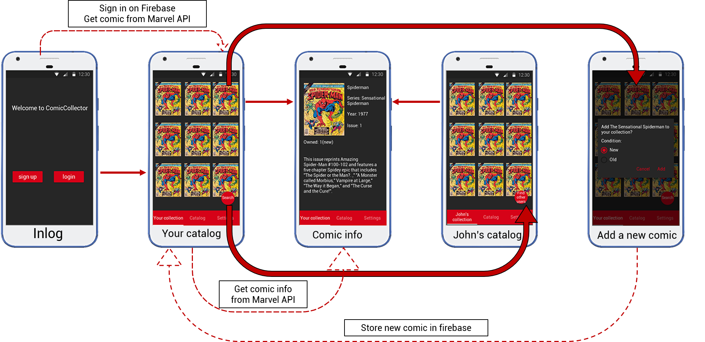
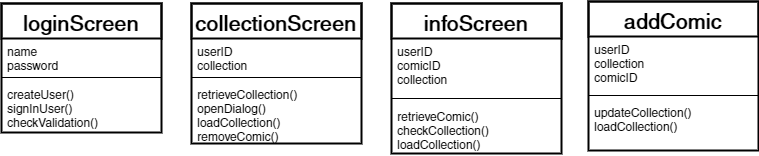

# ComicCollector
## Design
### API en Frameworks
Ik zal FireBase gebruiken voor informatie over de user en de MarvelAPI voor alle informatie over de comics.
### Datasources
Dit zal de Marvel API zijn.
### Databases
In FireBase zal als volgt werken:
- users
    - userId
        - userName
        - password
        - collection
            - comicId
                - condition

### Images

